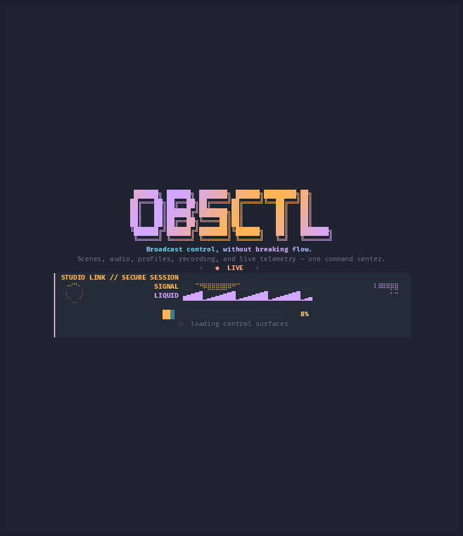
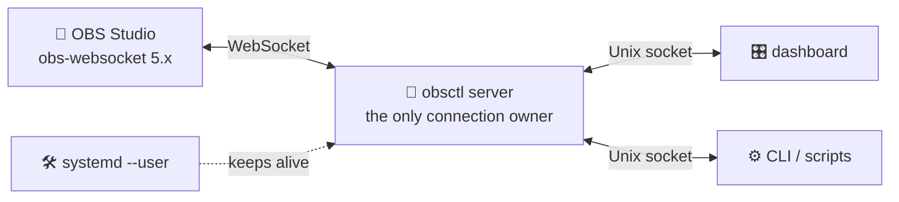

<div align="center">


# 📡 obsctl

### Drive OBS Studio from your terminal. No mouse, no clicking around. 🖱️🚫

**A snappy dashboard, a scriptable CLI, and a little daemon that keeps the OBS connection warm.**

```bash
curl -fsSL https://worxbend.github.io/obsctl/install.sh | sh
```

[](https://github.com/worxbend/obsctl/releases)
[](https://crystal-lang.org/)
[](https://github.com/obsproject/obs-websocket)
[](LICENSE)

🎛️ **Control** · 📊 **Watch** · 🤖 **Automate** · 🔁 **Stay connected**

[Website](https://worxbend.github.io/obsctl/) · [Install](#-install) · [First 5 minutes](#-your-first-five-minutes) · [Cheat sheet](#-cheat-sheet) · [Scripting](#-scripting) · [Docs](#-more-docs)



<sub>👆 An unedited session, sped up 2×. The same recording <a href="https://worxbend.github.io/obsctl/#demo">plays as sharp, scrubbable text on the website</a> — or locally with <code>asciinema play docs/demo/obsctl.cast</code>.</sub>

</div>

---

## 🤔 What even is this?

You're live. Your mic is hot, your scene is wrong, and OBS is buried behind a
game on another monitor. **obsctl** is OBS in a terminal window:

- 🎛️ **A dashboard** — scenes, audio levels, profiles, collections, logs and
  stream health on one screen. Switch scenes with `Enter`, ride the mic gain
  with `↑`/`↓`. A beacon in the header corner animates differently for idle,
  recording, on air, and both — so you can tell what OBS is doing at a glance.
- 🤖 **A CLI** — `obsctl scene brb`, `obsctl mute mic`. Perfect for hotkeys,
  Stream Deck buttons, cron jobs, or a chat bot.
- 🧠 **A tiny daemon** — one background process holds the OBS connection and
  reconnects when OBS restarts. Everything else just talks to it. Fast, and no
  connection storm.

Think of it as `kubectl`, but for your stream. And it's keyed like **Neovim**
(AstroNvim, specifically), so `:` runs commands and `Space` opens a menu of
what you can press next.

**You'll like it if you:** live on a keyboard ⌨️ · run OBS on a small or
headless machine 🖥️ · want stream actions in scripts 📜 · think a terminal is a
perfectly nice place to be 🧡

---

## ⚡ Install

One line. Works on any Linux, any distro — the binaries are static.

```bash
curl -fsSL https://worxbend.github.io/obsctl/install.sh | sh
```

**What that actually does** (no magic, promise 🙂):

1. 📥 Grabs the right build for your CPU (`amd64` or `arm64`)
2. 🔐 Checks it against the release's `SHA256SUMS.txt` — if the hash is wrong,
   **nothing** gets installed
3. 📁 Drops the binary in `~/.local/bin` (or `/usr/local/bin` if you're root)
4. ✅ Runs it once to make sure it works

> [!TIP]
> Nervous about piping a script into a shell? Good instinct. It's
> [`install.sh`](install.sh) right here in this repo — read it first, or
> download and run it yourself.

<details>
<summary>🎚️ Options, pinned versions, and other ways to install</summary>

```bash
# a specific release, into a specific folder
curl -fsSL https://worxbend.github.io/obsctl/install.sh | sh -s -- --version v0.6.0 --dir /usr/local/bin

# same thing with environment variables
OBSCTL_VERSION=v0.6.0 OBSCTL_INSTALL_DIR=/usr/local/bin sh install.sh
```

The installer is also attached to every release, so this URL works too:
`https://github.com/worxbend/obsctl/releases/latest/download/install.sh`

**By hand:** download a tarball from the
[Releases page](https://github.com/worxbend/obsctl/releases), check it against
`SHA256SUMS.txt`, unpack, and put `obsctl` on your `PATH`.

**From source** (needs Crystal 1.21+ and Shards):

```bash
git clone https://github.com/worxbend/obsctl.git
cd obsctl && shards install && make release
install -Dm755 bin/obsctl ~/.local/bin/obsctl
```

</details>

**Check it worked:**

```bash
obsctl --version
```

Nothing happened? `~/.local/bin` probably isn't on your `PATH`. Add this to
your `~/.bashrc` or `~/.zshrc`:

```bash
export PATH="$HOME/.local/bin:$PATH"
```

---

## 🐣 Your first five minutes

Never touched obs-websocket before? Start here. Five steps, nothing skipped.

### 1️⃣ Turn on the OBS WebSocket server

In OBS Studio: **Tools ▸ WebSocket Server Settings**

- ☑️ Tick **Enable WebSocket server**
- 🔌 Leave the port at **4455** (that's what obsctl expects)
- 🔑 Click **Show Connect Info** and copy the password — or untick
  **Enable Authentication** if this machine is only yours
- 💾 Hit **Apply**, then **OK**

<sub>Don't see the menu item? You're on OBS older than 28. Update OBS — 28 and
up ship obs-websocket 5 built in.</sub>

### 2️⃣ Create a config file

```bash
obsctl init
```

That writes `~/.config/obsctl/config.yml` with sensible defaults. You don't
have to edit it yet.

### 3️⃣ Hand over the password

obsctl never stores your password in a file. Put it in the environment:

```bash
export OBS_WEBSOCKET_PASSWORD='the password you copied'
```

Put that line in your `~/.bashrc` / `~/.zshrc` so it sticks around. 🔒
No authentication? Skip this — obsctl connects with an empty password.

### 4️⃣ Start the daemon

In a terminal, leave this running:

```bash
obsctl server --headless
```

You should see a log line like `obs_connected  connected to OBS 31.0.0`. 🎉
(Later, make it automatic: `obsctl service install && obsctl service start`.)

### 5️⃣ Open the dashboard

In a second terminal:

```bash
obsctl
```

That's it — you're in. Now play:

| Press this | And… |
| --- | --- |
| `j` / `k` | move down / up the list |
| `Enter` | switch to that scene 🎬 |
| `a` then `←` `→` | pick the audio panel, walk the channels 🎚️ |
| `↑` `↓` on a channel | ride its gain 🔊 |
| `m` | mute / unmute the selected input 🔇 |
| `Space` then `s` | jump straight to any scene by its number 🎬 |
| `Space` | open the leader menu — it shows you every option ✨ |
| `:` | command line, e.g. `:scene brb` |
| `F2` | pick a prettier theme 🎨 |
| `q` | quit |

> [!NOTE]
> Nothing on screen or an error? Jump to
> [Something broke?](#-something-broke) — it's almost always one of three
> things.

---

## 📸 The tour

Everything below happens in [the recording at the top of this
page](#-obsctl) — it's the whole tour, and it's deliberately the only
showcase here. A screenshot goes stale the moment a panel is redrawn and
nothing catches it; a recording gets re-made from the code it documents. 🎬

- **Press `Space` and obsctl tells you what's next** — the which-key menu,
  exactly like AstroNvim.
- **Type `:` for a command line**, with completion for every scene and input
  you have.
- **41 built-in themes**, previewed live before you commit. `F2` or
  `<leader>ut`. Twelve of them are `vivid`: near-black grounds under a gradient
  that swings across the colour wheel — violet into toxic green, orange into
  gold, cyan into hot pink. The [website](https://worxbend.github.io/obsctl/#console)
  will repaint itself in eight of them if you click a swatch.

### 🎚️ A mixing desk, not a list

Every audio input is a vertical channel strip, the way OBS' own vertical mixer
lays them out:

```text
├ ⣾  Audio Matrix  03  [a] Mic/Aux (mic) · ←/→ chan ↑/↓ gain m mute ─┤
┃  mic    desktop   guest                                            ┃
┃ ▔▔▔ │    ▂▂▂ │    ░·░ │        ← peak hold, meter, fader           ┃
┃ ███ ━    ███ │    ░·░ ━                                            ┃
┃ ███ ┃    ███ ━    ░●░ ┃                                            ┃
┃-4.2 dB  -12.4 dB    –∞                                             ┃
┃  72%      48%      60%                                             ┃
┃ ♪ LIVE   ♪ LIVE   ✖ MUTE                                           ┃
```

The meter fills bottom-up in eighth-height blocks, so it reads eight times
finer than the rows it has, and each cell is coloured by the level it stands
for — green up to −20 dBFS, yellow to −9, red above it. The bar over the top
is the peak hold: it jumps to your loudest moment and slides back down on its
own. A channel that clips flashes its name; a channel that has never sent a
reading shows a searching dot, so *silent* and *not there* don't look alike. 🟢🟡🔴

Short on rows? The panel drops the dB readout first, then the gain, then the
mute button. The meters are the last thing to go.

### 📊 Stream health, while you're live

When the stream starts, a **Stats** panel opens next to the logs:

```text
├ 📊  Stats  352   dropped frames ──────────────┤
│ ⚡ 59.94 fps  █████▇██  ⏱ 1.42 ms             │
│ ▸ RENDER missed     12 / 128,400   0.01%      │
│ ▸ OUTPUT skipped   340 / 128,000   0.27%      │
│ ◆ HEALTH         nominal  · budget 9%         │
```

Frames missed to rendering lag, frames skipped to encoding lag, and how much of
each frame's budget you're burning. Green is fine, yellow means look at it, red
means your viewers are already seeing it. 🟢🟡🔴

---

## 🎹 Cheat sheet

The dashboard is keyed like AstroNvim: `:` is the command line, `Space` is the
leader, and the motions are vim's.

### Moving around

| Key | What happens |
| --- | --- |
| `j` `k` or `↑` `↓` | Move inside the focused panel |
| `gg` / `G` | Jump to the first / last item |
| `Ctrl-D` / `Ctrl-U` | Half a panel down / up |
| `Ctrl-W` + `h` `j` `k` `l` | Move between panels (also plain `Ctrl-h/j/k/l`) |
| `Enter` | Activate — switch scene, profile, or collection ✅ |
| `m` | Mute / unmute the selected input 🔇 |
| `q` or `Ctrl-C` | Quit 👋 |

**On the audio matrix the axes follow the desk**, not the list — the strips
stand side by side, so the keys do too:

| Key | What happens |
| --- | --- |
| `←` `→` or `h` `l` | Move to the previous / next channel 🎚️ |
| `↑` `↓` or `k` `j` | Gain up / down on that channel 🔊 |
| `m` | Mute / unmute it 🔇 |

### The leader menu (`Space`)

Press `Space` and a menu appears showing every next key. No memorising.

| Keys | What it does |
| --- | --- |
| `<leader>s` | 🎬 Switch scene — the quick picker, see below |
| `<leader>f` → `s` `a` `p` `c` | 🔍 Find: scenes, audio, profiles, collections |
| `<leader>u` → `t` | 🎨 UI: theme picker |
| `<leader>o` → `r` `d` `c` | 🔧 OBS: reload config, dump config, reconnect |
| `<leader>m` | 🔇 Toggle mute |
| `<leader>q` | 👋 Quit |

`Esc` (or any key that leads nowhere) closes it. The old single letters —
`s` `a` `p` `c` `r` `D` `R` — still work too.

### 🎬 Switch scenes in two keys (`<leader>s`)

Press `Space` then `s`. Every scene appears with **one key** next to it — and
that key switches to it. No cursor, no `Enter`.

```text
╭─ 🎬  Switch scene  03  ↑↓ move  ↵ switch  esc close ─╮
│ 1  Main Camera                                       │
│ 2  Screen Share                                      │
│ 3  BRB                                               │
╰──────────────────────────────────────────────────────╯
```

`Space` `s` `2` and you're on Screen Share. Three keystrokes, mid-stream.

| Key | What it does |
| --- | --- |
| `1`–`9` then `a`–`z` | Switch to that scene, immediately |
| `↑` `↓` | Move the cursor (for scene 36 and beyond, which run out of keys) |
| `Enter` | Switch to the one under the cursor |
| `Esc` | Never mind |
| Click a row | Switch to it |

Two things worth knowing:

- **The picker takes every key while it's open.** `q` doesn't quit and `m`
  doesn't mute — they're scene labels in here. Only `Esc` leaves. A key that
  isn't a label does nothing at all, so a typo costs you a keystroke and not
  your place.
- **Your configured shortcuts win.** If a scene has `shortcut: b` in your
  config, it keeps `b` here, and the automatic labels work around it. The key
  the scenes panel shows you as `[b]` is the key that works. Shortcuts longer
  than one character (`brb`) still work on the command line and in the CLI —
  they just can't be a single press.

### The command line (`:`)

| Key | What it does |
| --- | --- |
| `:` or `/` | Open it |
| `Tab` / `Shift-Tab` or `Ctrl-N` / `Ctrl-P` | Cycle completions |
| `Ctrl-U` / `Ctrl-W` | Clear the line / delete a word |
| `Enter` | Run it |
| `Esc` | Never mind |

```text
:scene "Main Camera"      :vol "Desktop Audio" 65
:mute Mic/Aux             :profile Streaming
:stream                   :collection Gaming
:rec start                :status
:q                        :h
```

Yes, `:q`, `:qa`, `:wq` and `:x` all quit. `:h` lists everything. 😄

### 🖱️ Mouse works too

| Do this | Get that |
| --- | --- |
| Click a row | Focus the panel, select the row |
| Click it **again** | Activate it (two steps, so a stray click can't cut your program scene 😅) |
| Click a channel's **MUTE** button | Mute / unmute |
| Wheel over a channel strip | Volume up / down, like a real mixer 🎚️ |
| `Shift` + wheel over audio | Scroll through the channels instead |
| Click a which-key entry | Run it, or open its group |
| Click a row in the scene picker | Switch to that scene; click outside to close |
| Click a completion chip | Put it on the command line |
| Click a theme | Preview it; click again to keep it |

---

## 🤖 Scripting

Everything the dashboard does, the CLI does — and it's built to be called from
scripts, hotkeys, and bots.

```bash
# Scenes and audio
obsctl scene brb                    # aliases and shortcuts work
obsctl mute mic
obsctl volume "Desktop Audio" 70

# Outputs
obsctl stream                       # toggle streaming
obsctl record start                 # start | stop | toggle | pause | resume | status

# What's going on?
obsctl status
obsctl doctor                       # checks everything, tells you how to fix it 🩺

# Live event feed, one JSON object per line
obsctl watch --topics state | jq -r '.data.current_scene'

# Tab completion for your shell
obsctl completions zsh > ~/.zfunc/_obsctl
```

### 📦 JSON for robots

Add `--json` to any scriptable command and get exactly one envelope on stdout:

```bash
obsctl scene main --json
```

```json
{"ok": true, "result": {"message": "scene set: Main Camera"}, "error": null, "exit_code": 0}
```

Exit codes are stable, so `if obsctl scene main; then …` just works:

| Code | Meaning |
| --- | --- |
| `0` | 🟢 Did what you asked |
| `1` | 🔴 Failed |
| `2` | ⚙️ Config problem |
| `3` | 🔌 Daemon or OBS unreachable |
| `4` | 📡 OBS refused the request |
| `5` | ✍️ Couldn't parse the command |
| `6` | 🔗 IPC problem |

<details>
<summary>🔬 Behaviour that matters inside scripts</summary>

- Colour is on only when stdout is a terminal. `NO_COLOR` and `--color=never`
  turn it off; `--color=always` forces it on.
- `-q` / `--quiet` drops the human message; the exit code is the signal.
- `--timeout SECONDS` bounds a single daemon round trip.
- `obsctl watch | head -5` ends cleanly with exit `0`.
- Names go to the daemon exactly as your shell delivers them, so quotes and
  backslashes are fine: `obsctl scene 'Camera "A"'`.

Full grammar, every JSON command, and the error codes:
[docs/commands.md](docs/commands.md).

</details>

---

## 🎨 Make it yours

`~/.config/obsctl/config.yml` — short, human, and validated:

```yaml
version: 1

connection:
  host: 127.0.0.1
  port: 4455
  password_env: OBS_WEBSOCKET_PASSWORD   # 🔒 the name of the variable, never the password

reconnect:
  enabled: true
  endless: true

ui:
  theme: ember          # 41 to choose from, or roll your own colours
  advanced_ui: true     # false = plain ASCII, no fancy glyphs
  show_icons: true
  locale: en            # en | uk

scenes:
  - name: Main Camera
    alias: main         # so you can type `obsctl scene main`
    shortcut: "1"

audio:
  inputs:
    - name: Mic/Aux
      alias: mic
      shortcut: m
```

💡 **Shortcut:** run `obsctl dump-config` once you're connected and obsctl fills
in your real scene and input names for you. It keeps your settings and makes a
backup.

Handy commands: `obsctl config explain` (where every setting came from) ·
`obsctl config diff` (what you changed) · `obsctl validate-config` (is it
sane?). Full reference: [docs/config.md](docs/config.md).

### 🔁 Keep the daemon running

Don't babysit a terminal — let systemd do it:

```bash
obsctl service install
obsctl service start
obsctl service status
```

No root needed; it's a `--user` unit at `~/.config/systemd/user/obsctl.service`.
`stop`, `restart`, and `uninstall` do what you'd expect.

---

## 🩺 Something broke?

**Start here — it fixes most things:**

```bash
obsctl doctor
```

It checks your config, credentials, socket, daemon, OBS connection, and service
unit, and prints a fix for anything it doesn't like.

| Symptom | Usually means | Fix |
| --- | --- | --- |
| 😴 `server unavailable` (exit `3`) | The daemon isn't running | `obsctl server --headless` or `obsctl service start` |
| 🔑 `authentication failed` | Wrong or missing password | Re-copy it from **Tools ▸ WebSocket Server Settings**, `export OBS_WEBSOCKET_PASSWORD=…` |
| 🔌 `connection refused` | WebSocket server is off, or wrong port | Enable it in OBS; check `connection.port` matches (4455) |
| 🤷 `unknown scene` | Name doesn't match OBS | `obsctl status` to see real names, or `obsctl dump-config` |
| 🧟 OBS was closed when it started | Nothing — it retries | `obsctl reconnect` to hurry it up |
| 🔣 Boxes instead of icons | Font has no glyphs | Install a Nerd Font, or set `ui.advanced_ui: false` |

Still stuck? Turn up the volume and read along:

```bash
obsctl --log-level debug server --headless
```

Logs also land in `~/.local/state/obsctl/obsctl.log`. Passwords are redacted
from both, so they're safe to paste into an issue. 🔐

---

## 🧠 How it works

One process owns the OBS connection. Everyone else asks it nicely.



Why bother? Because it means 🔌 exactly one WebSocket per session · 🔄 every
client sees the same state instantly · 🧯 reconnect logic lives in one place ·
⚡ CLI commands don't pay for a handshake every time.

The socket lives in `$XDG_RUNTIME_DIR/obsctl/` (falling back to
`/tmp/obsctl-$UID/`). Nothing listens on the network — this is a local tool.

Under the hood it's Crystal, and the TUI is drawn with **CryTUI**, an in-tree
immediate-mode library inspired by Ratatui, tested against memory, ANSI, and
real PTY backends.

---

## 📚 More docs

| 📖 | What's inside |
| --- | --- |
| [Website](https://worxbend.github.io/obsctl/) | The pretty version of this page (and where the installer lives) |
| [Commands](docs/commands.md) | Every command, flag, JSON envelope, and error code |
| [Configuration](docs/config.md) | Every setting, with defaults and examples |
| [Protocol](docs/protocol.md) | IPC framing, topics, and the compatibility fixtures |
| [CryTUI notes](docs/tui-research.md) | How the rendering layer came to be |
| [Demo recording](docs/demo/README.md) | How the cast above is recorded, trimmed, and turned into a GIF |
| [Contributing](CONTRIBUTING.md) | Setup, the four build gates, project layout |
| [Changelog](CHANGELOG.md) | What changed, and why |
| [Security](SECURITY.md) | Reporting holes, and how credentials are handled |
| [More worxbend tools](https://obs.worxbend.com/) | The sibling streaming utilities 🧰 |

---

## 🤝 Contributing

Bugs, docs, ideas, code — all welcome. 🙌

```bash
shards install
make check      # format + lint + build + test, the same four gates CI runs
```

The test suite is deterministic and **doesn't need OBS running** — there's a
fake obs-websocket server, real Unix sockets, and real PTYs in the repo. Add a
regression test at the narrowest layer that catches your bug, and you're
golden.

Changed a theme? Re-export the palettes the website styles itself from
(CI fails if the committed copy is stale):

```bash
make site-themes      # site/themes.js, read from the real theme table
```

Changed the dashboard enough that the demo no longer matches? Re-record it —
[`docs/demo/README.md`](docs/demo/README.md) has the exact commands, including
how to trim the recording and regenerate the GIF above. 🎬

**Filing an issue?** Include your OBS and obs-websocket versions, your terminal
and `$TERM`, what you ran, what you expected, and what you got. For rendering
issues, terminal size and font help a lot. Never paste passwords or auth
strings — and for security holes, use [SECURITY.md](SECURITY.md) instead of a
public issue. 🔒

---

## 📜 License

[MIT](LICENSE). Do what you like with it.

<div align="center">

---

Built with 💎 Crystal, escape sequences, and an unreasonable love for reliable
broadcast controls.

**If obsctl saves your stream even once, a ⭐ would be lovely.**

</div>
