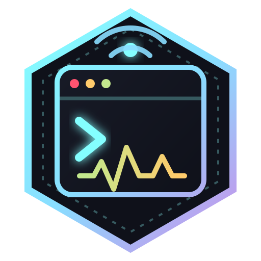
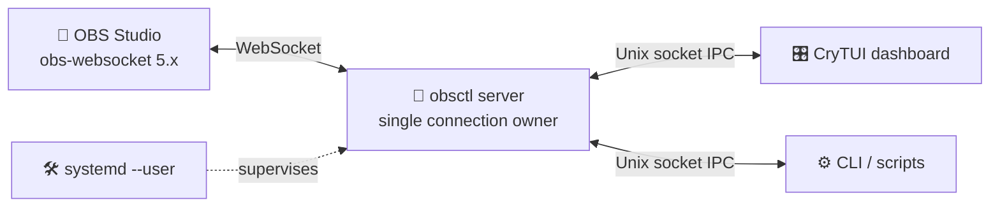

<div align="center">



# 📡 obsctl

### Your OBS control room—right inside the terminal.

**A fast Crystal TUI, automation-friendly CLI, and resilient local daemon for OBS Studio.**

🎛️ **Control** · 📊 **Observe** · 🤖 **Automate** · 🔁 **Stay connected**

[](https://github.com/worxbend/obsctl/releases)
[](https://crystal-lang.org/)
[](https://github.com/obsproject/obs-websocket)
[](LICENSE)

[Get started](#-quick-start) · [Explore the TUI](#-the-control-room) · [Automate with the CLI](#-cli--automation) · [Read the docs](#-documentation)

</div>

---

`obsctl` gives streamers, operators, and automation scripts one dependable
control surface for OBS Studio. Use the responsive terminal dashboard while
you are live, run precise one-shot commands from scripts, or keep the local
daemon running as a user service.

```text
╭─ OBSCTL // BROADCAST COMMAND CENTER ─────────────────────────────╮
│ ● daemon: connected   ● OBS: connected   scene: Main Camera      │
├─ LIVE TELEMETRY ─────────────────────────────────────────────────┤
│ CPU  3.2%    FPS 60.0    MEM 742MB    NET 5842kbps               │
├─ Scenes ────────────────┬─ Audio Matrix ─────────────────────────┤
│ ▶ Main Camera           │ ● Mic/Aux          72%  ███████░░░     │
│   Screen Share          │ ○ Desktop Audio    48%  █████░░░░░     │
╰─────────────────────────┴────────────────────────────────────────╯
```

## ✨ Why obsctl?

| | Capability | What it gives you |
| --- | --- | --- |
| 🎛️ | **Live terminal dashboard** | Scenes, audio, profiles, collections, output state, telemetry, logs, and a command palette in one responsive view. |
| ⚡ | **Fast interactions** | Optimistic UI updates, debounced volume changes, incremental rendering, and safe terminal resize reflow. |
| 🧠 | **One OBS connection** | A local daemon owns the WebSocket, eliminating competing CLI/TUI connections and centralizing reconnect behavior. |
| 🤖 | **Automation-ready CLI** | Stable commands, JSON envelopes, canonical error codes, and meaningful exit statuses for scripts and CI. |
| 🔁 | **Resilient operation** | Bounded reconnect backoff, explicit reconnect control, state subscriptions, and secret-safe diagnostics. |
| 🎨 | **Made for humans** | 29 built-in themes, custom colors, Unicode and ASCII modes, English/Ukrainian UI surfaces, and keyboard-first navigation. |
| 🧱 | **Built on CryTUI** | An in-tree immediate-mode Crystal TUI library inspired by Ratatui and tested with memory, ANSI, and real PTY backends. |

## 🚀 Quick start

### Prerequisites

- Linux
- OBS Studio with **obs-websocket 5.x** enabled
- Crystal **1.20.2+** and Shards when building from source
- A UTF-8 terminal; a Nerd Font is recommended for the richest icon set

### 1. Build

```bash
git clone https://github.com/worxbend/obsctl.git
cd obsctl
shards install
make release
install -Dm755 bin/obsctl ~/.local/bin/obsctl
```

The release binary is written to `bin/obsctl`. Prebuilt static binaries for
`linux-amd64` and `linux-arm64`, with `SHA256SUMS.txt`, are published on the
[Releases page](https://github.com/worxbend/obsctl/releases). They are linked
against musl, so they do not depend on your glibc version.

### 2. Initialize

```bash
obsctl init
obsctl validate-config
```

The default configuration lives at `~/.config/obsctl/config.yml`. Override it
with `--config PATH` or `OBSCTL_CONFIG`.

If OBS authentication is enabled, export its password before starting the
server:

```bash
export OBS_WEBSOCKET_PASSWORD='your OBS WebSocket password'
```

No password? No problem—when the variable is absent, `obsctl` attempts the
connection with an empty password.

### 3. Start the daemon and TUI

In one terminal:

```bash
obsctl server --headless
```

In another:

```bash
obsctl
```

Once connected, import live scene and audio names while preserving your local
settings:

```bash
obsctl dump-config
```

> [!TIP]
> Scene and audio names discovered from OBS work immediately. Running
> `dump-config` is useful for adding memorable aliases and shortcuts, but it is
> not required before using the TUI.

## 🎛️ The control room

The TUI is a thin local client: it subscribes to daemon state, OBS events, and
logs, then renders them through CryTUI. It does **not** open another OBS
WebSocket connection.

### Keyboard map

| Key | Action |
| --- | --- |
| `s` / `a` / `p` / `c` | Focus scenes, audio, profiles, or collections |
| `↑` `↓` or `j` `k` | Move within the focused panel |
| `Ctrl` + arrows or `Ctrl-h/j/k/l` | Move between panels |
| `Enter` | Activate the focused scene, profile, or collection |
| `m` | Toggle the focused audio input mute state |
| `←` `→` or `h` `l` | Lower or raise focused input volume |
| `/` or `:` | Open the command palette |
| `Tab` / `Shift-Tab` | Cycle command completions |
| `Ctrl-T` or `F2` | Open the appearance lab |
| `r` / `D` / `R` | Reload config, dump config, or reconnect OBS |
| `q` or `Ctrl-C` | Quit |

Rapid volume keypresses update the display immediately and coalesce into one
OBS command 120 ms after input stops. Terminal shrinking and expansion trigger
a full safe repaint; normal frames return to cell-level incremental updates.

### Command palette

Press `/` and use the same grammar as the CLI:

```text
/scene "Main Camera"
/mute Mic/Aux
/vol "Desktop Audio" 65
/profile Streaming
/collection Gaming
/stream
/rec start
/rec status
/status
/reconnect
```

## 🧰 CLI & automation

The daemon-backed CLI is designed to be pleasant interactively and predictable
inside scripts.

```bash
# Status
obsctl status
obsctl obs-status
obsctl server-status

# Scenes and audio
obsctl scene main
obsctl mute mic
obsctl unmute mic
obsctl toggle-mute mic
obsctl volume "Desktop Audio" 70

# Studio and output controls
obsctl stream
obsctl record
obsctl reconnect

# Diagnostics
obsctl doctor
obsctl doctor --json

# Recording
obsctl record start
obsctl record pause
obsctl record resume
obsctl record stop
obsctl record status --json

# Event stream for scripts
obsctl watch --topics state | jq -r '.data.current_scene'

# Shell completions (bash, zsh, fish)
obsctl completions bash > /etc/bash_completion.d/obsctl

# Configuration and lifecycle
obsctl validate-config
obsctl dump-config
obsctl reload-config
obsctl config explain
obsctl config diff
obsctl config migrate --dry-run
obsctl shutdown-server
```

Aliases, shortcuts, exact OBS names, and case-insensitive names are supported.
Quote names containing spaces.

### JSON mode

Add `--json` before or after a scriptable command:

```bash
obsctl --json status
obsctl scene main --json
```

Every JSON invocation writes exactly one envelope to stdout:

```json
{
  "ok": true,
  "result": {"message": "scene set: Main Camera"},
  "error": null,
  "exit_code": 0
}
```

Failures use canonical error codes and matching process exit statuses, making
them straightforward to handle in shell scripts and other tools. See the
[command reference](docs/commands.md) for the full grammar, supported JSON
commands, error codes, and status schema.

### Scripting behavior

Human output is decorated only when stdout is a terminal, so redirecting or
piping gives you plain text; `NO_COLOR` and `--color=never` also disable it, and
`--color=always` forces it back on. `-q`/`--quiet` drops the human message and
leaves the exit code as the only signal, and `--timeout SECONDS` bounds a single
daemon round trip. Streaming into a short-lived reader, as in
`obsctl watch | head -5`, ends cleanly with exit `0`.

Names are passed to the daemon exactly as the shell delivers them, so scenes and
inputs containing quotes or backslashes work without special handling:

```bash
obsctl scene 'Camera "A"'
```

## 🏗️ Architecture



The daemon is the authoritative state owner. This boundary provides:

- exactly one OBS WebSocket connection per user session;
- shared state and event delivery across every local client;
- centralized reconnect, validation, logging, and secret handling;
- short-lived CLI processes without repeated OBS handshakes.

The Unix socket lives under `$XDG_RUNTIME_DIR/obsctl/` when an XDG runtime
directory is available, with a user-specific `/tmp/obsctl-$UID/` fallback.
Control remains local—there is no network-facing obsctl API.

## 🔧 Configuration

A minimal configuration looks like this:

```yaml
version: 1

connection:
  host: 127.0.0.1
  port: 4455
  password_env: OBS_WEBSOCKET_PASSWORD

reconnect:
  enabled: true
  endless: true

ui:
  theme: default
  advanced_ui: true
  show_icons: true
  locale: en

scenes:
  - name: Main Camera
    alias: main
    shortcut: "1"

audio:
  inputs:
    - name: Mic/Aux
      alias: mic
      shortcut: m
```

Important behavior:

- secrets belong in environment variables; plaintext password values produce a
  secret-safe warning;
- unknown top-level fields are rejected instead of being silently discarded;
- config rewrites are atomic and preserve backups;
- `dump-config` refuses to create ambiguous aliases or shortcuts;
- `OBSCTL_LOCALE` overrides `ui.locale`; supported UI locales are `en` and `uk`;
- custom themes can override any subset of the semantic color palette.

See the complete [configuration reference](docs/config.md).

## 🛠️ Run as a user service

No root daemon is required. Install a `systemd --user` unit using the current
binary path:

```bash
obsctl service install
obsctl service start
obsctl service status
```

Other lifecycle commands:

```bash
obsctl service stop
obsctl service restart
obsctl service uninstall
```

The generated unit lives at `~/.config/systemd/user/obsctl.service`.

## 🩺 Troubleshooting

### Show connection and retry diagnostics

```bash
obsctl --log-level debug server --headless
```

Server logs are mirrored to stderr and persisted at
`~/.local/state/obsctl/obsctl.log`. Passwords and generated authentication
strings are redacted from both sinks. WebSocket resets include the close code,
reason, reconnect attempt, and next delay.

### The CLI says the server is unavailable

Start it directly:

```bash
obsctl server --headless
```

Or install/start the user service. Thin client commands exit with status `3`
when the daemon or OBS connection is unavailable.

### OBS was offline during startup

Reconnect is enabled by default. Check `obsctl server-status`, then request an
immediate attempt with `obsctl reconnect`. If `reconnect.enabled: false`,
restart the server after OBS becomes available.

## 🧑‍💻 Development

```bash
shards install
make format
make test
make build
make release
make lint
```

The local test suite is deterministic and does not require OBS Studio. It uses
a fake obs-websocket server, Unix-socket integration tests, memory rendering,
ANSI assertions, and real PTY lifecycle probes.

Optional cross-implementation fixture verification against a sibling
`../obsctl-rs` checkout:

```bash
make contract-rs-compat
```

Strict compatibility mode requires a recognized fixture root in both
repositories. See [docs/protocol.md](docs/protocol.md) for the contract model.

## 📚 Documentation

| Guide | Contents |
| --- | --- |
| [Commands](docs/commands.md) | Complete CLI/palette grammar, JSON envelopes, errors, and status semantics |
| [Configuration](docs/config.md) | Connection, reconnect, UI, theme, alias, and persistence settings |
| [Protocol](docs/protocol.md) | IPC framing, subscriptions, state contracts, and compatibility fixtures |
| [CryTUI research](docs/tui-research.md) | Ratatui analysis, Crystal library evaluation, rendering architecture, and parity evidence |
| [Contributing](CONTRIBUTING.md) | Setup, the four build gates, project layout, and release process |
| [Changelog](CHANGELOG.md) | Release history |
| [Security](SECURITY.md) | Reporting vulnerabilities, credential handling, and the daemon's trust boundary |

## 🤝 Contributing

Issues, focused bug reports, documentation improvements, and pull requests are
welcome. For behavior changes, include a regression test at the narrowest
useful layer and run `make check` before opening a PR — see
[CONTRIBUTING.md](CONTRIBUTING.md) for the full workflow.

Useful reports include:

- your OBS Studio and obs-websocket versions;
- terminal name, dimensions, font, and `$TERM` for rendering issues;
- sanitized `obsctl.log` excerpts for connection problems;
- the exact command, expected result, and actual result.

Please never include OBS passwords or generated authentication strings.

For security vulnerabilities, do not open a public issue — follow
[SECURITY.md](SECURITY.md) instead.

## 📜 License

`obsctl` is released under the [MIT license](LICENSE).

---

<div align="center">

Built with 💎 Crystal, terminal escape sequences, and an unreasonable love for
reliable broadcast controls.

**If obsctl improves your control room, consider starring the repository. ⭐**

</div>
